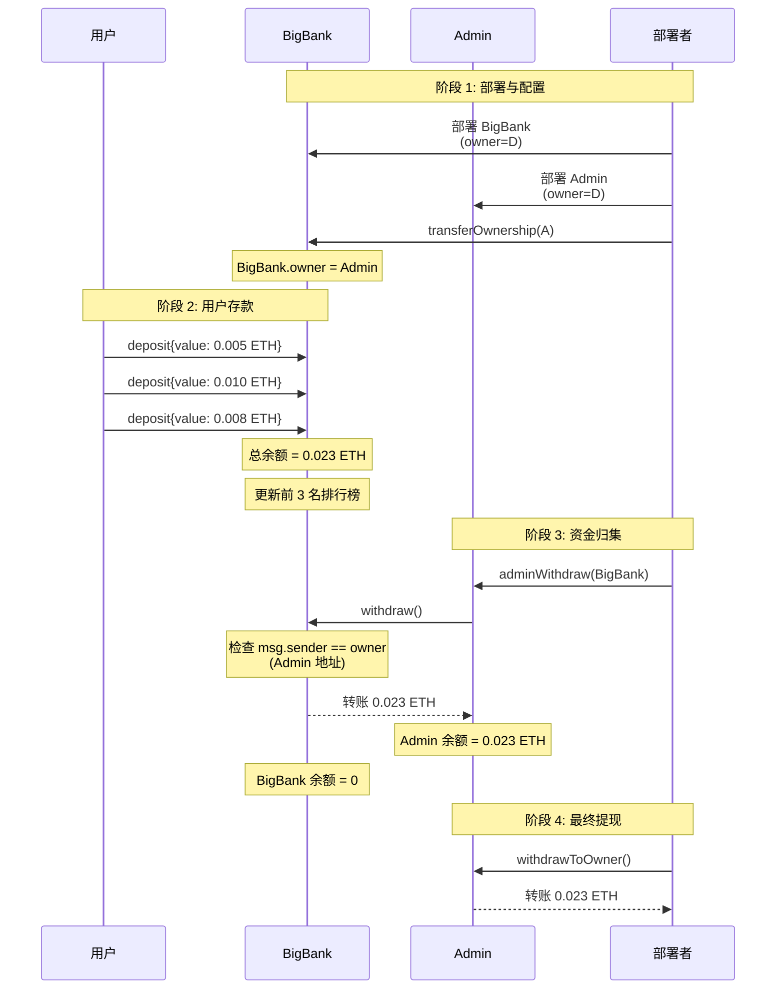
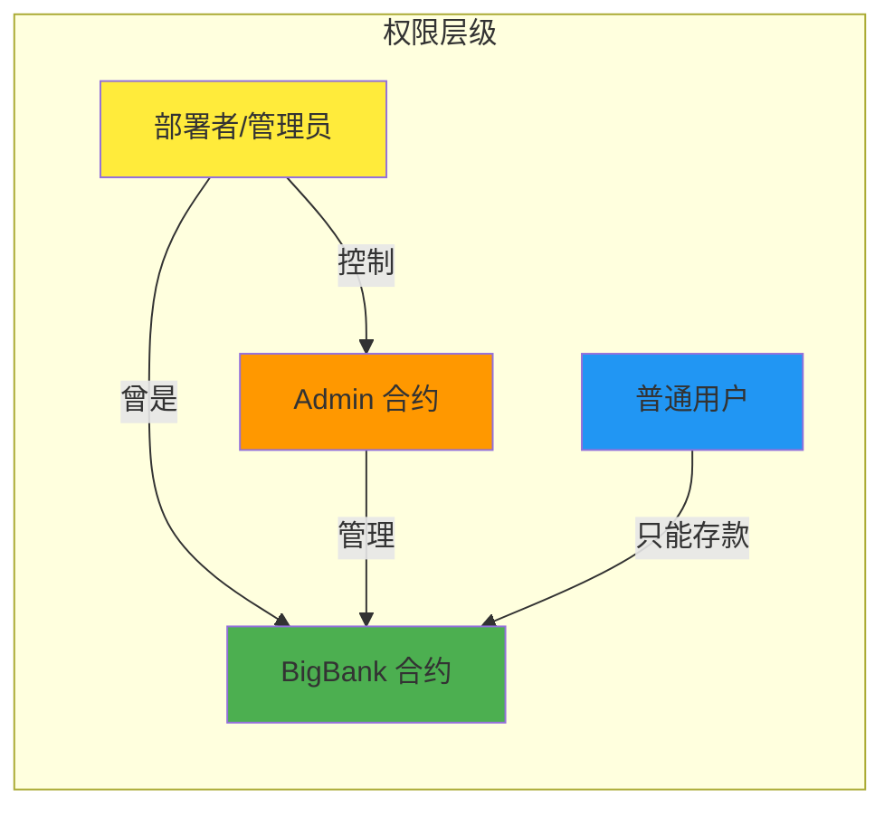

我将为你展示当前 Solidity 银行合约项目的整体架构。

## 🏗️ **项目整体架构**

```
eth_project/
└── bank/
    ├── IBank.sol          # 接口定义层
    ├── bank.sol           # 基础合约层
    ├── bigbank.sol        # 扩展合约层
    └── admin.sol          # 管理合约层
```


## 📋 **各模块详细功能**

### **1️⃣ IBank.sol - 接口定义层**

```solidity
interface IBank {
    function owner() external view returns (address);
    function getContractBalance() external view returns (uint256);
    function withdraw() external;
    function transferOwnership(address newOwner) external;
}
```

**作用：**
- ✅ 定义银行合约的标准接口
- ✅ 实现跨合约调用的类型安全
- ✅ 支持多态性（可对接不同银行实现）

---

### **2️⃣ Bank.sol - 基础合约层**

```solidity
contract Bank is IBank {
    address public override owner;
    mapping(address => uint256) public balances;
    address[] public topDepositors;
    
    // 核心功能
    - 存款（receive/fallback/deposit）
    - 提款（withdraw/withdrawPartial）
    - 前 3 名排行榜（updateTopDepositors）
    - 管理员管理（transferOwnership）
}
```

**核心特性：**
- ✅ 实现 IBank 接口
- ✅ 支持 MetaMask 直接转账存款
- ✅ 维护存款金额前 3 名排行榜
- ✅ 重入攻击防护（nonReentrant）
- ✅ 完整的事件系统

---

### **3️⃣ BigBank.sol - 扩展合约层**

```solidity
contract BigBank is Bank {
    uint256 public constant MIN_DEPOSIT_AMOUNT = 1e15; // 0.001 ETH
    
    modifier minDepositAmount() {
        require(msg.value >= MIN_DEPOSIT_AMOUNT);
        _;
    }
    
    receive() external payable override nonReentrant minDepositAmount { ... }
    fallback() external payable override nonReentrant minDepositAmount { ... }
    function deposit() public payable override minDepositAmount { ... }
}
```

**扩展功能：**
- ✅ 继承 Bank 的所有功能
- ✅ 添加最小存款限制（≥ 0.001 ETH）
- ✅ 使用修饰器控制存款门槛
- ✅ 支持管理员转移

---

### **4️⃣ Admin.sol - 管理合约层**

```solidity
contract Admin {
    address public owner;
    
    function adminWithdraw(IBank bank) public onlyOwner nonReentrant {
        require(bank.owner() == address(this));
        bank.withdraw();
        emit AdminWithdrawal(address(bank), balance);
    }
    
    function withdrawToOwner() public onlyOwner nonReentrant { ... }
}
```

**管理功能：**
- ✅ 独立的管理员系统
- ✅ 跨合约资金归集
- ✅ 调用其他银行合约的 withdraw
- ✅ 资金从子合约 → 母合约

---

## 🔄 **业务流程图**



## 🔐 **权限管理架构**



## 💼 **使用场景**

### **场景 1：单一银行管理**
```javascript
// 直接使用 Bank 合约
部署 Bank → 管理员直接管理
```

### **场景 2：高门槛 VIP 银行**
```javascript
// 使用 BigBank 合约
部署 BigBank → 限制最小存款 → 筛选高质量用户
```

### **场景 3：多银行资金归集**
```javascript
// 使用 Admin + 多个 BigBank
部署 Admin
部署 BigBank1, BigBank2, BigBank3
将所有 BigBank 的 owner 转移给 Admin
Admin.adminWithdraw() 归集所有资金
```

## 🎯 **设计模式总结**

| 设计模式 | 应用位置 | 作用 |
|---------|---------|------|
| **接口隔离** | IBank.sol | 定义标准，解耦实现 |
| **继承** | BigBank extends Bank | 代码复用，功能扩展 |
| **修饰器** | onlyOwner, nonReentrant | 权限控制，安全防护 |
| **组合** | Admin 使用 IBank | 跨合约调用，多态 |
| **工厂模式** | 多合约部署 | 灵活创建实例 |

